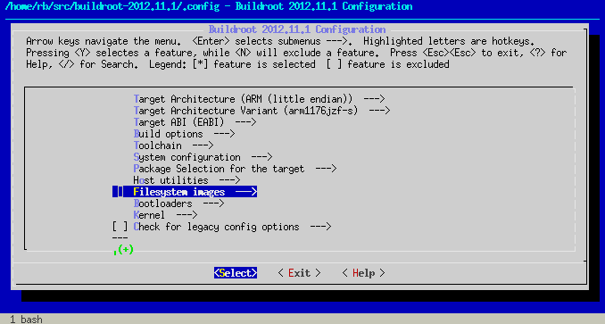

In today's blog post I will explain how to build your own custom Linux system for the Raspberry Pi.

The ideal tool for such an endeavour would be an automated build system which took a set of requirements - the list of packages to include, kernel configuration, etc. - and created a self-contained root filesystem for the Pi, together with a freshly built kernel (`kernel.img`), boot loader, firmware (`bootcode.bin`, `start.elf`) and config files (`config.txt`, `cmdline.txt`) ready to be placed onto the `/boot` partition of the SD card.

As it turns out, there *is* a system like that out there - it's called [Buildroot][] - and with a little bit of customization we can shape it into the build system we want.

[Buildroot]: http://buildroot.uclibc.org/

Buildroot grew out from the [µClibc] (microcontroller libc) project, a reimplementation of the standard Unix C library specially targeted for embedded Linux systems. The µClibc people needed a tool which would automate the creation of such systems, and this need has driven the development of Buildroot.

[µClibc]: http://uclibc.org/

##### Test drive

As the best way to learn something is by doing it, I'll show you how to build a basic root filesystem with Buildroot.

Download and extract the latest stable Buildroot release to a temporary directory:

```bash
mkdir -p $HOME/buildroot
cd $HOME/buildroot
wget http://buildroot.uclibc.org/downloads/buildroot-2012.11.1.tar.gz
tar xvzf buildroot-2012.11.1.tar.gz
```

The archive will be unpacked into a directory called `buildroot-2012.11.1`. Enter this directory (referred to as `$TOPDIR` later on):

```bash
cd buildroot-2012.11.1
```

and invoke the following make target to configure the system:

```bash
make menuconfig
```

The configuration tool uses `kconfig`, so it will be quite familiar if you have ever configured a Linux kernel.

<p></p>

Here are the settings you should change (everything else can be left at defaults):

###### Top level configuration

<table class="dl">
  <tr>
    <th>Target Architecture</th>
    <td>`ARM (little endian)`</td>
  </tr>
  <tr>
    <th>Target Architecture Variant</th>
    <td>`arm1176jzf-s`</td>
  </tr>
  <tr>
    <th>Target ABI</th>
    <td>`EABI`</td>
  </tr>
</table>

These correspond to what we have on the Raspberry Pi.

###### Build options

<table class="dl">
  <tr>
    <th>Download dir</th>
    <td>`$(HOME)/buildroot/dl`</td>
  </tr>
  <tr>
    <th>Enable compiler cache</th>
    <td>`YES`</td>
  </tr>
  <tr>
    <th>Compiler cache location</th>
    <td>`$(HOME)/buildroot/ccache`</td>
  </tr>
</table>

`Download dir` specifies the directory where Buildroot will download the sources of all packages we have selected for the build. In the default setup, this is a directory under `$TOPDIR`, but I preferred an external location to enable reuse and prevent accidental removal.

Buildroot can use [ccache] for compilation of C/C++ source code; this means that object files built with a given command line (compiler configuration) are saved in a cache and are reused when the same object file shall be built again. This saves a lot of time with repeated builds (typical when tinkering) so I turned it on.

[ccache]: http://ccache.samba.org/

###### Toolchain

<table class="dl">
  <tr>
    <th>Kernel Headers</th>
    <td>`Linux 3.6.x kernel headers`</td>
  </tr>
  <tr>
    <th>GCC compiler Version</th>
    <td>`GCC 4.7.x`</td>
  </tr>
</table>

We'll use the latest `rpi-3.6.y` kernel branch from the [foundation's git repository][raspberrypi-linux] and here we select the matching kernel headers.

[raspberrypi-linux]: https://github.com/raspberrypi/linux

<table class="dl">
  <tr>
    <th>Purge unwanted locales</th>
    <td>`YES`</td>
  </tr>
  <tr>
    <th>Locales to keep</th>
    <td>`C en_US`</td>
  </tr>
  <tr>
    <th>Generate locale data</th>
    <td>`en_US`</td>
  </tr>
</table>

You may want to add others, I prefer to keep these pruned to the absolute minimum.

<table class="dl">
  <tr>
    <th>Use software floating point by default</th>
    <td>`NO`</td>
  </tr>
  <tr>
    <th>Use ARM Vector Floating Point unit</th>
    <td>`YES`</td>
  </tr>
</table>

We need these for `hardfp`. Essential stuff.

<table class="dl">
  <tr>
    <th>Enable large file (files > 2 GB) support</th>
    <td>`YES`</td>
  </tr>
  <tr>
    <th>Enable IPv6 support</th>
    <td>`YES`</td>
  </tr>
  <tr>
    <th>Enable WCHAR support</th>
    <td>`YES`</td>
  </tr>
  <tr>
    <th>Enable C++ support</th>
    <td>`YES`</td>
  </tr>
</table>

These seemed like a good idea (and without them, certain packages cannot be selected).

###### System configuration

<table class="dl">
  <tr>
    <th>System hostname</th>
    <td>`rpi`</td>
  </tr>
  <tr>
    <th>System banner</th>
    <td>`Welcome to Raspberry Pi!`</td>
  </tr>
  <tr>
    <th>/dev management</th>
    <td>`Dynamic using mdev`</td>
  </tr>
  <tr>
    <th>Port to run a getty (login prompt) on</th>
    <td>`tty1`</td>
  </tr>
  <tr>
    <th>Baudrate to use</th>
    <td>`38400`</td>
  </tr>
</table>

The system hostname and the banner can be anything you wish.

`Dynamic using mdev` means that:

1. we will use the kernel-provided `devtmpfs` filesystem for `/dev` - this pseudo fs is automatically populated when Linux detects new hardware
2. we'll be able to write hotplug scripts to handle device attach/disconnect events, which sounds nice

The getty baudrate is 38400 because that's what I've seen in my `/etc/inittab`.

###### Package selection for target

This is the section where you specify which packages get in and which will be left out.

[Busybox][] - which is enabled by default - gives us a fairly complete userland, so the only extra you should enable here is [dropbear][], a small SSH server under `Networking applications` which will let us log in remotely.

[Busybox]: http://www.busybox.net/
[dropbear]: https://matt.ucc.asn.au/dropbear/dropbear.html

You may select other packages too, as you see fit.

###### Filesystem images

<table class="dl">
  <tr>
    <th>Compression method</th>
    <td>`gzip`</td>
  </tr>
</table>

We ask Buildroot to generate a `rootfs.tar.gz` as well (besides `rootfs.tar`).

###### Kernel

<table class="dl">
  <tr>
    <th>Linux Kernel</th>
    <td>`YES`</td>
  </tr>
  <tr>
    <th>Kernel version</th>
    <td>`Custom Git tree`</td>
  </tr>
  <tr>
    <th>URL of custom Git repository</th>
    <td>`https://github.com/raspberrypi/linux`</td>
  </tr>
  <tr>
    <th>Custom Git version</th>
    <td>`rpi-3.6.y`</td>
  </tr>
  <tr>
    <th>Kernel configuration</th>
    <td>`Using a defconfig`</td>
  </tr>
  <tr>
    <th>Defconfig name</th>
    <td>`bcmrpi`</td>
  </tr>
  <tr>
    <th>Kernel binary format</th>
    <td>`zImage`</td>
  </tr>
</table>

With these settings, Buildroot will clone the foundation's `rpi-3.6.y` branch, configure it using `arch/arm/configs/bcmrpi_defconfig` (included in the source) and build a `zImage` which we can then shove into `/boot`. (Note that post-processing with the `imagetool-uncompressed.py` script is not needed anymore as the latest firmware can load `zImage` kernels without a hitch.)

Now exit the configuration program - save the new configuration as you leave! - and initiate a full build of the system by executing:

```bash
make all
```

Buildroot will go through the following steps:

1. Build a compiler toolchain (gcc, binutils, libtool, autoconf, automake, m4, cmake, pkg-config, etc.) for the host machine running Buildroot <br/>=> `$TOPDIR/output/host`
2. Build a `gcc` which can cross-compile to the ARM architecture, together with an ARM µClibc <br/>=> `$TOPDIR/output/toolchain`
3. Unpack, configure and build all selected packages using the compiler (and µClibc) built in step 2 <br/>=> `$TOPDIR/output/build/<package>-<version>`<br/>(build dependencies are also installed to `$TOPDIR/output/staging`)
4. Install packages <br/>=> `$TOPDIR/output/target`
5. Create a root file system image <br/>=> `$TOPDIR/output/images/rootfs.tar.gz`<br/>and install the kernel<br/>=> `$TOPDIR/output/images/zImage`

##### Post-build fixup

There are some minor issues which we'll have to deal with before we can use our freshly baked root fs on the Pi.

As root, unpack `output/images/rootfs.tar.gz` to its destined place (most likely `/dev/mmcblk0p2` or your NFS root - we'll call this `$ROOTDIR` from here) and go through the following steps:

###### Set a root password

In the default fs, root has no password:

```bash
# cat /etc/shadow
root::10933:0:99999:7:::
bin:*:10933:0:99999:7:::
daemon:*:10933:0:99999:7:::
adm:*:10933:0:99999:7:::
lp:*:10933:0:99999:7:::
sync:*:10933:0:99999:7:::
shutdown:*:10933:0:99999:7:::
halt:*:10933:0:99999:7:::
uucp:*:10933:0:99999:7:::
operator:*:10933:0:99999:7:::
ftp:*:10933:0:99999:7:::
nobody:*:10933:0:99999:7:::
default::10933:0:99999:7:::
```

This would be fine if we logged in via the console (or over telnet), but dropbear *requires* a password to be set if we want to SSH to the box.

A crypt-based password is fine, so let's create a crypted version of the word `passpass` and set it as the root password in `/etc/shadow`:

```bash
CRYPTEDPASS=$(perl -e 'print crypt("passpass","salt")')
sed -i -e "s#^root:[^:]*:#root:$CRYPTEDPASS:#" $ROOTDIR/etc/shadow
```

###### Mount /boot

We want to mount `/dev/mmcblk0p1` to `/boot` on the Pi, so we create a mount point and write the necessary entry to `/etc/fstab`:

```bash
install -d -m 0755 $ROOTDIR/boot
echo '/dev/mmcblk0p1 /boot vfat defaults 0 0' >> $ROOTDIR/etc/fstab
```

###### Copy firmware files and kernel to /boot

Mount the SD card's first partition to - let's say - `/mnt/rpi/boot` (`$BOOTDIR`), then:

```bash
cp $TOPDIR/output/images/zImage $BOOTDIR/kernel.img
git clone https://github.com/raspberrypi/firmware
cp firmware/boot/bootcode.bin $BOOTDIR
cp firmware/boot/start.elf $BOOTDIR
cp firmware/boot/fixup.dat $BOOTDIR
```

We also need a command line for our kernel, so put the following line into `$BOOTDIR/cmdline.txt`:

```
dwc_otg.lpm_enable=0 console=ttyAMA0,115200 kgdboc=ttyAMA0,115200 console=tty1 elevator=deadline rootwait root=/dev/mmcblk0p2 rootfstype=ext4
```

This comes from Raspbian and you may vary it as you wish - here is my latest NFS root cmdline for example:

```
dwc_otg.lpm_enable=0 console=ttyAMA0,115200 kgdboc=ttyAMA0,115200 console=tty1 elevator=deadline rootwait ip=::::rpi::dhcp root=/dev/nfs nfsroot=192.168.1.1:/mnt/shares/rpifs/nfsroot,tcp,rsize=32768,wsize=32768
```

(For the syntax and semantics of the `ip` parameter see the relevant [kernel docs][nfsroot.txt].)

[nfsroot.txt]: https://www.kernel.org/doc/Documentation/filesystems/nfs/nfsroot.txt

Now the system is ready: put the SD card into your Pi and hope for the best. :-) (But seriously, it should work.)
