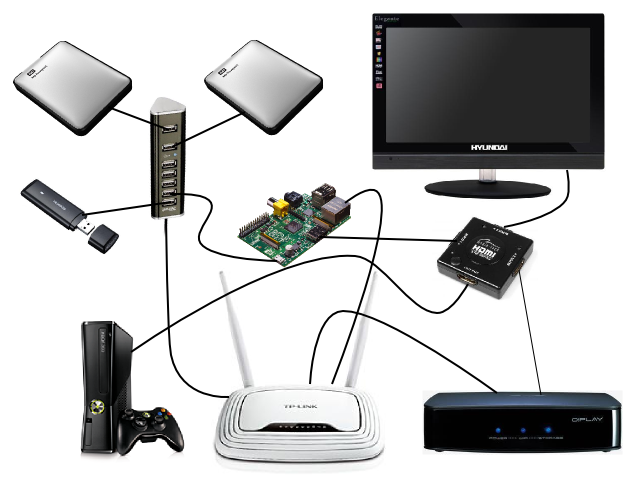

My first hack was to move the root filesystem from the SD card's second ext4 partition to a network-accessible directory shared by my router over NFS.

To understand how this hack fits into the grand scheme of things, I'll have to introduce you to my home network:

<p></p>

On the image you see the following gear:

* the Pi (obviously)
* a Trust 7-port USB hub
* two external HDDs
* Huawei USB 3G modem
* HDMI switch
* HDMI TV
* XBox 360
* TP-Link WR842ND wireless router (with an extra USB port)
* Asus O!Play media player

The Pi draws its power from the Trust USB hub through a simple USB-microUSB cable. After reading a lot of bitter posts about power-related problems, I was quite afraid that this setup wouldn't work, but fortunately it does.

The TP-Link router was modded: I replaced the factory firmware with [OpenWRT][], a home-grown Linux distribution specially developed for Linux-based routers.

[OpenWRT]: https://openwrt.org/

OpenWRT made it possible to share the NTFS filesystems on the two external USB harddrives over Samba (Windows file-sharing) and NFS to the home network, which means the Asus O!Play can now stream HD movies from any of the external disks (via a direct Ethernet connection to the router), and my son can watch his favorite Simpsons episodes from his bed on his Android phone (over WiFi). Internet is provided by the Huawei 3G modem connected to one of the Trust hub's USB ports.

In order to move the Pi's root filesystem over to NFS, I needed an ext4 partition which the router can access and share over the network. As the router is not too capable on the storage front (it has only 8 MB of flash memory), I had to create the ext4 filesystem on one of the external disks.

The only way I could do this - without reformatting the drives (remember, we are dealing with NTFS filesystems) - was to create a 8 GB file on one of the disks and then create the ext4 filesystem *inside* that file:

```bash
opkg install ntfs-3g
mkdir -p /mnt/shares/samsung
mount -t ntfs-3g /dev/sda1 /mnt/shares/samsung
dd if=/dev/zero of=/mnt/shares/samsung/rpifs.img bs=1G count=8
opkg install e2fsprogs
mkfs.ext4 -F /mnt/shares/samsung/rpifs.img
opkg install kmod-fs-ext4
opkg install kmod-loop losetup
mkdir -p /mnt/shares/rpifs
mount -t ext4 -o loop /mnt/shares/samsung/rpifs.img /mnt/shares/rpifs
```

(These were all executed on the router. I added the `opkg install` commands to let you see which OpenWRT packages were required. Of course the mounts were later recorded into `/etc/config/fstab` for auto-mounting.)

While this setup is rather complicated and slow, it works. Ideally, the external disks would form a RAID1 cluster (provided by a NAS device like [this][fantec]), and the RAID volume would be formatted with ext4 (which is *much* faster than `ntfs-3g` on Linux).

[fantec]: http://www.fantec.de/html/en/2/artId/__1515/gid/__500905309053790537290/article.html

The next step was to create a suitable root filesystem on `/mnt/shares/rpifs`. At first, I just used the files from the default Raspbian installation:

```bash
mkdir /tmp/raspbian
mount -t ext4 -o loop,offset=$((122880*512)) 2012-12-16-wheezy-raspbian.img /tmp/raspbian/
rsync -av /tmp/raspbian/ /mnt/shares/rpifs/
```

This crazy `mount` (or rather `losetup`) trick allows you to mount a *part* of a disk image - like one of the partitions inside - via a loop device. To make it work, you have to find out where the desired partition starts (byte offset from start of image file) and pass that to mount via the `offset` option. You can use `fdisk` to find the right number:

```bash
[rb@pluto 2012-12-16-wheezy-raspbian]$ fdisk -l 2012-12-16-wheezy-raspbian.img 

Disk 2012-12-16-wheezy-raspbian.img: 1939 MB, 1939865600 bytes, 3788800 sectors
Units = sectors of 1 * 512 = 512 bytes
Sector size (logical/physical): 512 bytes / 512 bytes
I/O size (minimum/optimal): 512 bytes / 512 bytes
Disk identifier: 0x00017b69

                         Device Boot      Start         End      Blocks   Id  System
2012-12-16-wheezy-raspbian.img1            8192      122879       57344    c  W95 FAT32 (LBA)
2012-12-16-wheezy-raspbian.img2          122880     3788799     1832960   83  Linux

```

As you can see, the FAT32 partition (`/boot`) comes first, starting at sector #8192, then comes the ext4 fs (`/`) at sector #122880. As each sector uses 512 bytes, we'll have to multiply the sector number by 512 to get the byte offset.

The only thing left was telling the Pi Linux kernel that it should mount its root fs from the router over NFS, instead of locally from the SD card.

As I wrote in the [previous][] post, the Linux kernel gets its command line from the file `cmdline.txt` on the `/boot` partition (first FAT32 partition of the SD card).

[previous]: ../my-first-day-with-the-raspberry-pi/

In the Raspbian image which I downloaded, this file has the following contents (also verifiable with the offset mount trick):

```
dwc_otg.lpm_enable=0 console=ttyAMA0,115200 kgdboc=ttyAMA0,115200 console=tty1 root=/dev/mmcblk0p2 rootfstype=ext4 elevator=deadline rootwait
```

This had to be changed like this:

```
dwc_otg.lpm_enable=0 console=ttyAMA0,115200 kgdboc=ttyAMA0,115200 console=tty1 root=/dev/nfs nfsroot=192.168.1.1:/mnt/shares/rpifs ip=dhcp elevator=deadline rootwait
```

1. The `root=/dev/nfs` option tells the kernel that the root filesystem is on NFS
2. The `ip=dhcp` option makes the kernel configure the primary network interface (eth0) via DHCP (this is a prerequisite for an NFS mount)
3. The `nfsroot=192.168.1.1:/mnt/shares/rpifs` defines the location of the root file system

Of course, the `/mnt/shares/rpifs` directory had to be shared on the router as well:

```bash
opkg install portmap nfs-kernel-server nfs-kernel-server-utils
echo '/mnt/shares/rpifs 192.168.1.0/24(rw,no_root_squash,insecure,no_subtree_check,mp)' >> /etc/exports
/etc/init.d/nfsd enable
/etc/init.d/nfsd start
```

After the NFS server was up, I verified that the share can be in fact mounted by entering the following commands on my netbook:

```bash
mkdir /tmp/rpifs
mount -t nfs 192.168.1.1:/mnt/shares/rpifs /tmp/rpifs
```

Then I updated `cmdline.txt` as described above, restarted the Pi and voilà, the root fs came up over NFS.
